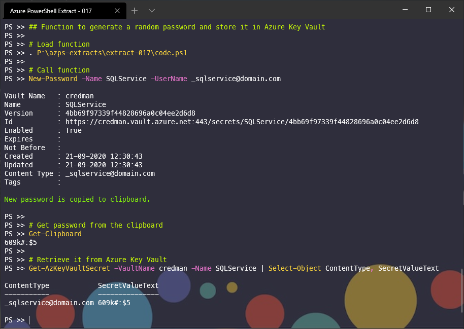

## Function to generate a random password and store it in Azure Key Vault

> ## Key Vault reference
> https://docs.microsoft.com/en-us/azure/key-vault/secrets/quick-create-powershell#create-a-resource-group 

```powershell
Function New-Password
{
    Param
    (
        # Secret name (Unique identification name)
        [Parameter(Mandatory = $true)]
        [Alias('KeyName')]
        [string] $Name,

        # Username or Description
        [Parameter(Mandatory = $true)]
        [Alias('Description')]
        [string] $UserName,

        # Manual password (in case of)
        [Parameter(Mandatory = $false)]
        [securestring] $Password,

        # Azure Key Vault Name
        [Parameter(Mandatory = $false)]
        [ValidateSet('credman','keysafe')]
        [string] $KeyVault = 'credman',

        # Length of the random password
        [Parameter(Mandatory = $false)]
        [int] $Length = 8
    )

    <# 
    33..47      ===     !"#$%&'()*+,-./
    48..57      ===     0123456789
    58..64      ===     :;<=>?@
    65..90      ===     ABCDEFGHIJKLMNOPQRSTUVWXYZ
    91..96      ===     [\]^_`
    97..122     ===     abcdefghijklmnopqrstuvwxyz
    123..126    ===     {|}~
    #>

    # Generate the random password, if the password is not entered manually
    if (-not $Password)
    {
        $RandomPassword = -join ((33..126) | Get-Random -Count $Length | ForEach-Object { [char]$_ })
        $Password = $RandomPassword | ConvertTo-SecureString -AsPlainText -Force
    }

    # Add password to Azure Key Vault
    Set-AzKeyVaultSecret -VaultName $KeyVault -Name $Name -SecretValue $Password -ContentType $UserName -DefaultProfile $KVContext -WarningAction SilentlyContinue

    # Copy new password to clipborad
    if ($RandomPassword)
    {
        $RandomPassword | Set-Clipboard
        Write-Host -Object "New password is copied to clipboard." -ForegroundColor Green
    }
}
```

